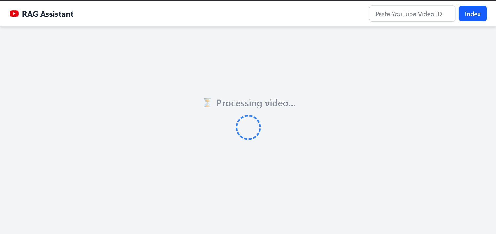
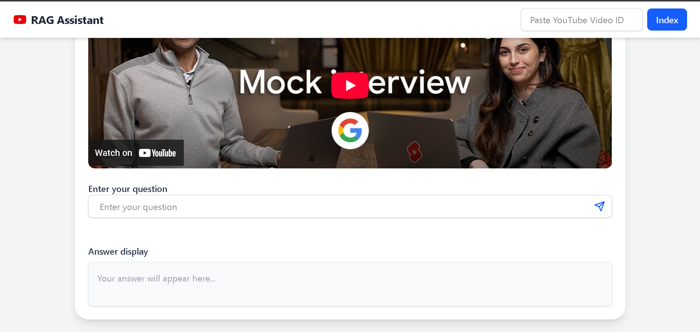

# Youtube Transcript QA Bot 🎥🤖

A full-stack AI-powered web application that allows users to **extract transcripts from YouTube videos**, **index them**, and then **ask questions** about the content using a RAG (Retrieval-Augmented Generation) pipeline built with **LangChain**, **FAISS**, and **Groq** (LLM inference).

---

## 🌟 Features

- 🔍 Automatically fetch and index YouTube video transcripts (English)
- 💬 Ask natural language questions based on the video's content
- ⚡ Fast inference using Groq-hosted LLMs
- 🧠 RAG pipeline powered by LangChain + HuggingFace + FAISS
- 🖥️ Full-stack app: React frontend + Django backend

---

## 🛠️ Tech Stack

- **Frontend:** React (Vite), Axios, React Router
- **Backend:** Django + Django REST Framework
- **LLM Inference:** Groq API with `llama3-8b-8192`
- **Vector Store:** FAISS
- **Embeddings:** HuggingFace Transformers (`all-MiniLM-L6-v2`)
- **Transcript Fetching:** `youtube-transcript-api`
- **Text Splitting:** LangChain RecursiveCharacterTextSplitter

---

## ⚙️ How It Works

1. **User inputs a YouTube video link**
2. The app extracts the video ID and fetches the English transcript
3. Transcript is split and embedded using HuggingFace
4. FAISS indexes and stores these embeddings locally
5. When the user asks a question:
   - LangChain uses a retriever (MultiQueryRetriever) to fetch relevant chunks
   - The prompt is constructed with retrieved context
   - The Groq LLM generates a response based on the transcript only

---

## 📂 Folder Structure

```
Youtube-Transcript-QA-Bot/
├── Backend/       # Django backend (API, RAG logic, transcript indexing)
│   └── rag_api/
│       └── views.py   # Core logic: indexing + querying
├── Frontend/            # React frontend (Video input, routing, results)
│   └── src/
│       └── components/
│           ├── YoutubeSearchBar.jsx
│           ├── VideoProcessingScreen.jsx
│           └── QueryBox.jsx
└── README.md
```

---

## 🧪 Local Development Setup

### ✅ Backend

1. **Clone the repo**

```bash
git clone https://github.com/your-username/yt-transcript-qa-bot.git
cd yt-transcript-qa-bot/rag_backend
```

2. **Create a virtual environment & install dependencies**

```bash
python -m venv venv
source venv/bin/activate  # or venv\Scripts\activate on Windows
pip install -r requirements.txt
```

3. **Add your API keys to `.env`**

```backend/.env
HUGGINGFACEHUB_API_TOKEN=your_hf_token
GROQ_API_KEY=your_groq_key
```

```frontend/.env
VITE_YOUTUBE_API_KEY=your_youtube_api_key(You can get this key by creating a project in Google Cloud Console and enabling the "YouTube Data API v3")
```
4. **Run backend server**

```bash
python manage.py runserver
```

### ✅ Frontend

```bash
cd ../client
npm install
npm run dev
```

---

## 🔐 Environment Variables

| Variable                | Purpose                    |
|-------------------------|----------------------------|
| `HUGGINGFACEHUB_API_TOKEN` | For sentence-transformers  |
| `GROQ_API_KEY`             | For accessing Groq's LLM   |
| `VITE_YOUTUBE_API_KEY`     | for searching YouTube videos  |

---


## 🧠 Models Used

- **LLM:** `llama3-8b-8192` (via Groq)
- **Embeddings:** `all-MiniLM-L6-v2` (HuggingFace)
- **Vector DB:** FAISS

---

## 📸 Demo Screenshots






## 📌 Notes

- YouTube transcripts must be available in English
- All indexing is **local** and fast
- 100% free APIs (Groq + HuggingFace)

---

## 🚧 Future Work

Here are some planned enhancements for the **YouTube Transcript QA Bot**:

- 🌍 **Multilingual Support**  
  Enable transcript parsing and question-answering in multiple languages using Whisper or other models.

- 🕒 **Chat History & Context Memory**  
  Store previous user questions and answers to maintain conversational context over time.

- 🔍 **Improved Video Search & Filtering**  
  Enhance the frontend to allow better YouTube search filtering by duration, views, or relevance.

- 🔐 **User Authentication (Optional)**  
  Enable user accounts to store history, preferences, or favorite videos.


## 🙌 Credits

- [LangChain](https://www.langchain.com/)
- [Groq](https://console.groq.com/)
- [HuggingFace](https://huggingface.co/)
- [YouTube Transcript API](https://pypi.org/project/youtube-transcript-api/)
